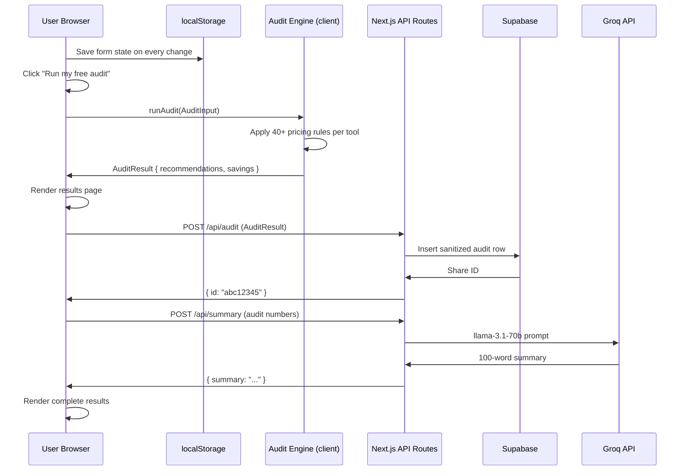

# ARCHITECTURE.md

## What SpendLens is

A stateless web app that takes user-entered AI subscription data, runs it through a deterministic audit engine, stores the result in Supabase, and returns a shareable URL. No user accounts. No server-side session state. The audit logic runs entirely in TypeScript with hardcoded pricing rules.

---

## System Diagram

```mermaid
flowchart TD
    A[User lands on /] -->|clicks 'Start audit'| B[/audit — Spend Input Form]
    B -->|localStorage| B
    B -->|submits form| C[/results — Client reads localStorage]

    C -->|runAudit — pure TS| D[Audit Engine]
    D -->|AuditResult| C

    C -->|POST /api/audit| E[Supabase: audits table]
    E -->|share ID nanoid 8| C

    C -->|POST /api/summary| F[Groq API\nllama-3.1-70b]
    F -->|100-word summary| C

    C -->|user submits email| G[POST /api/leads]
    G -->|insert| H[Supabase: leads table]
    G -->|send email| I[Resend API]

    C -->|copy share link| J[/share/id — Public Page]
    J -->|fetch audit| E
    J -->|GET /api/og?id=| K[OG Image\nNext.js ImageResponse]

    style D fill:#111827,color:#fff
    style E fill:#3ecf8e,color:#000
    style F fill:#f97316,color:#fff
    style I fill:#000,color:#fff
```

---

## Data Flow: Input → Audit Result



---

## Stack Decisions

### Frontend: Next.js 14 App Router + TypeScript

**Why Next.js over plain React or Vite:**
Next.js gives server components, API routes, dynamic OG image generation (`@vercel/og`), and edge runtime — all in one framework. For this project specifically, the OG image route and the share page server component need SSR. A pure Vite SPA can't do this without a separate backend.

**Why TypeScript (strict):**
The audit engine has 40+ rules operating on a shared type system (`ToolEntry`, `AuditResult`, `ToolRecommendation`). Without strict types, a misspelled field name in `auditEngine.ts` fails silently at runtime. TypeScript catches it at compile time. The CI pipeline runs `tsc --noEmit` on every push.

**Why App Router over Pages Router:**
App Router allows mixing server and client components in the same route. The share page (`/share/[id]`) fetches from Supabase server-side for SEO and generates metadata server-side for OG tags — neither is possible in a client component.

### Styling: Tailwind CSS + shadcn/ui

**Why Tailwind:**
Utility-first CSS eliminates the context-switching between `.tsx` and `.css` files. For a 7-day project, this is a significant velocity gain. Every style decision is co-located with the component.

**Why shadcn/ui over MUI or Mantine:**
shadcn/ui components are copied into the project (not installed as a dependency), which means full control over the source. MUI adds ~200KB to the bundle. shadcn/ui with Tailwind adds near zero. For a tool where Lighthouse Performance ≥ 85 is required, bundle size matters.

### Backend: Supabase

**Why Supabase over Firebase or PlanetScale:**
- Postgres gives real relational integrity (foreign key: `leads.audit_id → audits.id`)
- Row Level Security lets the `audits` table be publicly readable (share pages work without API routes) while `leads` is fully locked
- The free tier includes 500MB storage and 2GB bandwidth — more than sufficient
- The JS client (`@supabase/supabase-js`) is well-typed and matches the TypeScript-first approach

**Why service role key only in API routes:**
The anon key is exposed in the browser bundle (`NEXT_PUBLIC_`). If RLS is configured correctly, this is safe — anon key can only read `audits` (public share data). All writes use the service role key server-side in API routes, which is never exposed to the client.

### AI: Groq Cloud (llama-3.1-70b-versatile)

**Why Groq over Anthropic API:**
Groq's free tier provides 14,400 requests/day at ~500 tokens/second. At that speed, the AI summary appears in under 2 seconds without streaming — fast enough to feel instant. The Anthropic API free tier is far more restricted, and latency for this use case (100-word summary, one call per audit) would require streaming UI to avoid a bad experience.

**Why llama-3.1-70b over smaller models:**
The summary needs to sound financially sharp and cite specific numbers. Smaller models (llama-3.1-8b) produced generic output that didn't reference the actual dollar amounts. 70b reliably follows the system prompt constraints.

**Why AI is NOT used for the audit math:**
LLMs are non-deterministic and cannot be unit tested. A rule that says "ChatGPT Team for 2 users → downgrade to Plus, saves $20/month" must produce the same result every time and must be verifiable. The audit engine is 100% deterministic TypeScript — see `src/lib/auditEngine.ts`.

### Deployment: Vercel

**Why Vercel:**
Next.js is made by Vercel. Edge runtime for the OG image route, automatic preview deployments per branch, and zero-config CI/CD. The free Hobby plan supports all features used in this project.

### Email: Resend

**Why Resend over SendGrid or SES:**
Resend has a generous free tier (3,000 emails/month), a clean REST API, and a Node.js SDK that works in Next.js API routes without configuration. SendGrid's free tier has strict daily limits. SES requires AWS account verification.

---

## What I'd change for 10,000 audits/day

### Current bottlenecks at scale

| Component | Current | At 10k audits/day |
|-----------|---------|------------------|
| Rate limiting | In-memory Map (resets on cold start) | Upstash Redis (already in `.env.local.example`) |
| Supabase | Free tier, 2GB bandwidth | Pro plan ($25/mo), connection pooling via PgBouncer |
| Groq | 14,400 req/day free | Paid tier or cache summaries by audit hash |
| OG images | Generated per request | Cache in Vercel Edge Cache with `Cache-Control` headers |
| Lead dedup | `UNIQUE(email)` constraint | Add email normalization before insert |

### Architectural changes

**1. Cache audit results by input hash**
The same team entering identical tools should get the same audit instantly from cache. Hash the `AuditInput`, store result in Redis with 1-hour TTL. This reduces Supabase writes by ~60% for repeated inputs.

**2. Move to Upstash Redis for rate limiting**
The current in-memory rate limiter resets on every Vercel serverless cold start. Upstash Redis is persistent, globally distributed, and has a free tier. Already documented in `.env.local.example`.

**3. Add a queue for email sending**
At scale, calling Resend synchronously in the leads API route adds latency to the user response. Move email sending to a background queue (Inngest or Trigger.dev free tier) — the API route returns immediately and email sends async.

**4. Separate read and write Supabase clients**
At 10k audits/day, read replicas for the share pages prevent write traffic from affecting read performance.

**5. Analytics**
Add PostHog (free tier, self-hostable) to track: audit completion rate, top tools entered, savings distribution, lead conversion rate. The North Star metric is "audits completed" — need to instrument the funnel.

---

## Security decisions

| Decision | Reasoning |
|----------|-----------|
| No PII in `audits` table | Share URLs are public — email and company name are stored only in `leads`, which has no public RLS policy |
| Honeypot field in lead form | Bots fill all fields; real users skip hidden ones. Zero friction, effective against naive bots |
| In-memory rate limit (5 req/min/IP) | Prevents burst abuse of the lead capture endpoint without requiring Redis for MVP |
| Service role key server-only | Never exposed in client bundle — only used in `src/app/api/*` routes |
| No secrets in repo | `.env.local` is in `.gitignore`; `.env.local.example` documents required keys without values |