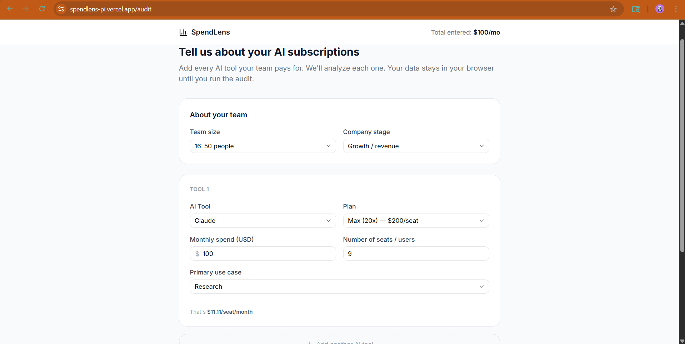
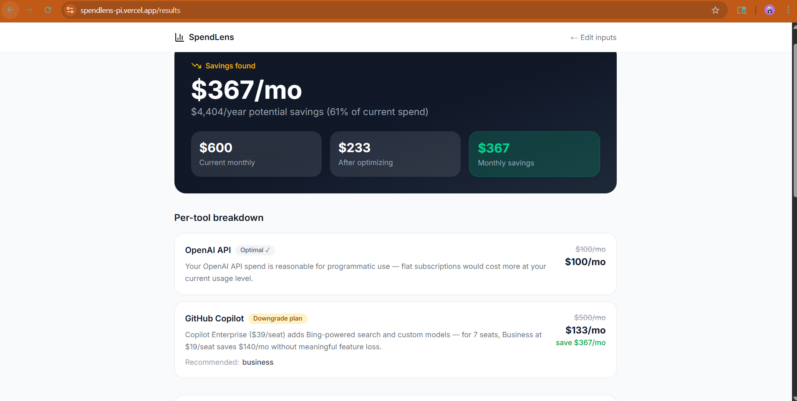
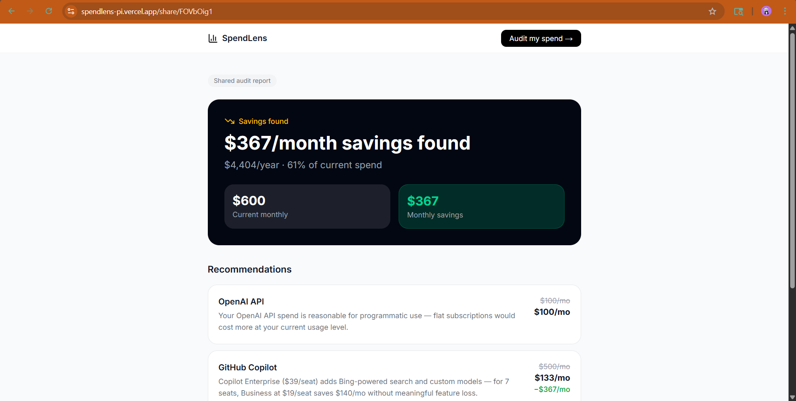

# SpendLens — Free AI Spend Audit for Startups

> "Stop guessing. Start saving on AI."

SpendLens is a free web app that audits how much your startup spends on AI tools — Cursor, ChatGPT, Claude, GitHub Copilot, Gemini, and more — and tells you exactly where you're overpaying, what to switch, and how much you'll save. Built for startup founders and engineering managers. No login required.

**Built for the Credex Web Development Intern assignment — Round 1.**

---


## Screenshots

### Landing Page


### Audit Form


### Results Page


### Share Page


**Live demo:** https://spendlens-pi.vercel.app/

## Quick Start

### Prerequisites
- Node.js 18+
- A Supabase project (free at [supabase.com](https://supabase.com))
- A Groq API key (free at [console.groq.com](https://console.groq.com))
- A Resend API key (free at [resend.com](https://resend.com))

### Install & run locally

```bash
# Clone the repo
git clone https://github.com/YOUR_USERNAME/spendlens.git
cd spendlens

# Install dependencies
npm install

# Set up environment variables
cp .env.local.example .env.local
# Fill in your Supabase URL, keys, Groq key, and Resend key

# Run database migrations
# Open your Supabase SQL Editor and run supabase-schema.sql

# Start development server
npm run dev
```

Visit [http://localhost:3000](http://localhost:3000)

### Run tests

```bash
npm run test          # Run all tests once
npm run test:watch    # Watch mode
npm run typecheck     # TypeScript type check
```

### Deploy to Vercel

```bash
# Install Vercel CLI
npm i -g vercel

# Deploy
vercel

# Add environment variables in Vercel dashboard:
# Settings → Environment Variables → add all from .env.local.example
```

---

## Tech Stack

| Layer | Technology |
|-------|-----------|
| Framework | Next.js 14 (App Router) |
| Language | TypeScript (strict) |
| Styling | Tailwind CSS + shadcn/ui |
| Database | Supabase (Postgres) |
| AI Summary | Groq Cloud (llama-3.1-70b-versatile) |
| Email | Resend |
| Charts | Recharts |
| Animations | Framer Motion |
| Testing | Vitest |
| CI/CD | GitHub Actions → Vercel |
| Deployment | Vercel |

---

## Project Structure

```
spendlens/
├── src/
│   ├── app/
│   │   ├── page.tsx              # Landing page
│   │   ├── layout.tsx            # Root layout + metadata
│   │   ├── audit/
│   │   │   └── page.tsx          # Spend input form
│   │   ├── results/
│   │   │   └── page.tsx          # Audit results page
│   │   ├── share/[id]/
│   │   │   ├── page.tsx          # Public share page (SSR)
│   │   │   └── SharePageClient.tsx
│   │   └── api/
│   │       ├── audit/route.ts    # Save audit to Supabase
│   │       ├── leads/route.ts    # Lead capture + email
│   │       ├── summary/route.ts  # Groq AI summary
│   │       └── og/route.tsx      # Dynamic OG image
│   ├── lib/
│   │   ├── auditEngine.ts        # Core audit logic (40+ rules)
│   │   ├── pricingData.ts        # Pricing constants (all sourced)
│   │   └── supabase.ts           # Supabase client setup
│   └── types/
│       └── index.ts              # All TypeScript types
├── __tests__/
│   └── auditEngine.test.ts       # 16 unit tests
├── .github/workflows/
│   └── ci.yml                    # Lint + typecheck + test on push
├── supabase-schema.sql           # Database schema
├── ARCHITECTURE.md
├── DEVLOG.md
├── ECONOMICS.md
├── GTM.md
├── LANDING_COPY.md
├── METRICS.md
├── PRICING_DATA.md
├── PROMPTS.md
├── REFLECTION.md
├── TESTS.md
└── USER_INTERVIEWS.md
```

---

## Key Decisions

Five trade-offs made during the build and why:

### 1. Rule-based audit engine, not AI
The audit math is 100% deterministic TypeScript with hardcoded pricing. I explicitly chose NOT to use an LLM for pricing recommendations.

**Why:** LLMs hallucinate prices, produce different outputs for identical inputs, and can't be unit tested. A finance person reading a recommendation like "ChatGPT Team for 2 users costs $60/month — downgrade to Plus at $40/month, saves $20/month" needs to be able to verify it against vendor pricing pages. Rule-based logic is the only correct approach here.

The LLM (Groq) is used only for the human-readable summary paragraph — a task where natural language matters and exact precision doesn't.

### 2. Groq over Anthropic API for the summary
The Anthropic API free tier has strict token limits, making it impractical for a public tool that could get hundreds of audits per day. Groq provides 14,400 free requests/day at ~500 tokens/second — fast enough that the summary appears without a noticeable loading state.

This was a deliberate trade-off: lower model quality ceiling (llama-3.1-70b vs Claude Sonnet) for much higher free throughput and lower latency.

### 3. No login, email captured after value shown
The spec required this, and it's also correct product design. Any email gate before the audit results would kill conversion. The results page shows full value — complete savings breakdown, AI summary, per-tool recommendations — before asking for an email.

This means some users get value without ever giving us their contact info. That's acceptable: the shareable link they generate (and potentially tweet) is itself a distribution asset.

### 4. Supabase over Firebase
Firebase is document-store oriented; the audit data has relational structure (leads reference audits by ID). Postgres with a foreign key constraint is the correct data model. Supabase also provides Row Level Security that lets the `audits` table be publicly readable (share pages work without auth) while `leads` is locked to service-role-only access.

### 5. shadcn/ui over MUI for UI components
MUI adds ~200KB to the client bundle. shadcn/ui components are copied into the project and tree-shaken with Tailwind — effectively zero bundle overhead for unused components. For a Lighthouse Performance ≥ 85 requirement, this matters. The trade-off is that shadcn/ui requires more manual customization than MUI's out-of-the-box components.

---

## Running the CI pipeline locally

```bash
# Lint
npm run lint

# Type check
npm run typecheck

# Tests
npm run test
```

All three must pass before committing. The GitHub Actions workflow runs them automatically on every push to `main`.

---

## License

MIT. Built as part of the Credex Web Development Intern assignment. Code is available for portfolio use.